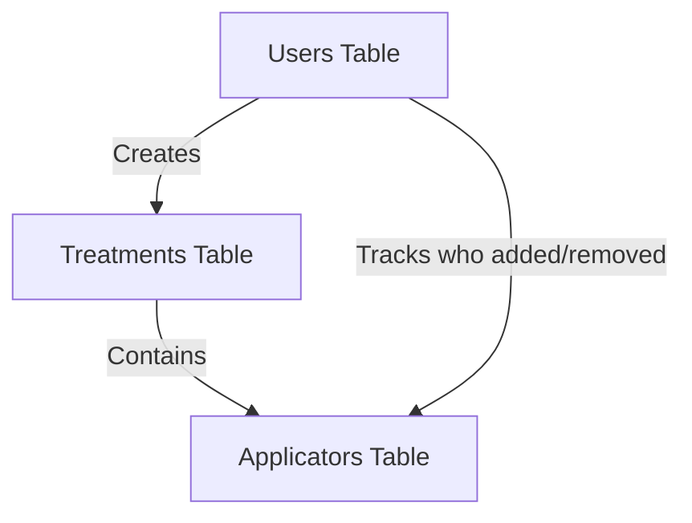

# Database Design Guide: Medical Treatment Tracking System
## A Senior Developer's Guide to Building a Production-Ready Offline-First Database

---

## Table of Contents
1. [Introduction: Why Database Design Matters](#introduction)
2. [The Offline-First Reality in Hospitals](#offline-first-reality)
3. [Three-Layer Data Architecture](#three-layer-architecture)
4. [Technology Selection](#technology-selection)
5. [Core Database Tables](#core-database-tables)
6. [Offline-Specific Tables](#offline-specific-tables)
7. [Field-by-Field Rationale](#field-by-field-rationale)
8. [Relationships & Foreign Keys](#relationships--foreign-keys)
9. [Synchronization Strategy](#synchronization-strategy)
10. [Conflict Resolution](#conflict-resolution)
11. [Design Patterns & Best Practices](#design-patterns--best-practices)
12. [Security Considerations](#security-considerations)
13. [Performance Optimization](#performance-optimization)
14. [Future-Proofing & Scalability](#future-proofing--scalability)
15. [Common Pitfalls to Avoid](#common-pitfalls-to-avoid)

---

## Introduction: Why Database Design Matters


When building a medical treatment tracking system, your database isn't just storage—it's the foundation of patient safety, regulatory compliance, and operational efficiency. A poorly designed database can lead to:
- Lost patient data (catastrophic in healthcare)
- Incorrect treatment records (legal liability)
- Performance bottlenecks (delays in critical care)
- Security breaches (HIPAA violations)

This guide will teach you not just WHAT to build, but WHY each decision matters, with special focus on **offline-first operation** for medical environments without reliable internet connectivity.

---

## The Offline-First Reality in Hospitals

### Why Hospitals Often Lack Reliable Internet

**Operating Room Constraints:**
- **Metal-shielded rooms** block WiFi signals
- **Ethernet ports unavailable** in sterile surgical areas  
- **Emergency procedures** cannot wait for connectivity
- **Medical equipment interference** disrupts wireless signals

**Real-World Scenarios:**
```
┌─────────────┐     ❌ No Internet    ┌──────────────┐
│  Treatment  │ ←──────────X───────→  │ Priority API │
│    Room     │                       │   (Cloud)    │
└─────────────┘                       └──────────────┘
     ↓ Must Still Work!
┌─────────────┐
│ Patient Care│
└─────────────┘
```

**Critical Requirements:**
- **100% Availability**: System must work without internet
- **Data Integrity**: No data loss when connection returns
- **Conflict Resolution**: Handle concurrent offline updates
- **Sync When Possible**: Automatic synchronization when online

---

## Three-Layer Data Architecture

To handle offline-first requirements, we implement a three-layer architecture:

```
Layer 1: LOCAL DATABASE (Always Available)
         ↓
Layer 2: SYNC QUEUE (Manages Updates)
         ↓
Layer 3: CLOUD DATABASE (When Connected)
```

### Layer 1: Local Database (IndexedDB/SQLite)
- **Purpose**: Immediate data storage, works 100% offline
- **Technology**: IndexedDB (browser) or SQLite (desktop app)
- **Capacity**: Stores weeks of treatment data locally
- **Access Speed**: Microseconds (no network latency)

### Layer 2: Sync Queue  
- **Purpose**: Tracks what needs syncing
- **Technology**: Local database tables with sync metadata
- **Function**: Ensures no data loss during synchronization
- **Priority**: Medical criticality determines sync order

### Layer 3: Cloud Database (PostgreSQL)
- **Purpose**: Central source of truth, multi-site access
- **Technology**: PostgreSQL on Azure
- **Access**: Only when ethernet/internet available
- **Backup**: Regular snapshots for disaster recovery

---

## Technology Selection

### Why PostgreSQL?

```sql
-- PostgreSQL was chosen over alternatives for specific reasons:
```

**1. Medical Data Integrity**
- **ACID Compliance**: Guarantees data consistency even during system failures
- **Example**: If power fails mid-transaction, patient data remains intact
- **Why it matters**: You can't lose a record of radioactive seed implantation

**2. Complex Relationships**
- **Advanced Foreign Keys**: Cascade deletes, complex constraints
- **Example**: When deleting a treatment, all associated applicators are removed
- **Why it matters**: Prevents orphaned medical records

**3. JSON Support**
- **JSONB Fields**: Store variable Priority API data without schema changes
- **Example**: Different hospitals send different metadata formats
- **Why it matters**: Flexibility without sacrificing structure

**4. Enterprise Features**
- **Row-Level Security**: Different hospitals see only their data
- **Point-in-Time Recovery**: Restore to any second in the past
- **Concurrent Access**: Multiple doctors can work simultaneously

### Why Sequelize ORM?

```javascript
// Instead of raw SQL:
const query = "SELECT * FROM users WHERE email = $1";

// We use Sequelize:
const user = await User.findOne({ where: { email } });
```

**Benefits:**
- **Type Safety**: TypeScript integration prevents SQL injection
- **Migrations**: Version control for database schema
- **Model Validation**: Catch errors before they hit the database
- **Relationship Management**: Automatic JOIN queries

---

## Core Database Tables

### The Three-Table Architecture



This design follows the **Single Responsibility Principle**:
- **Users**: WHO is performing actions
- **Treatments**: WHAT procedure is being done
- **Applicators**: HOW the procedure is executed

Let me explain why we need exactly these three tables, plus additional tables for offline operation...

---

## Offline-Specific Tables

### Sync Queue Table: Managing Offline Changes

```sql
CREATE TABLE sync_queue (
    id UUID PRIMARY KEY DEFAULT gen_random_uuid(),
    
    -- What to sync
    table_name VARCHAR(50) NOT NULL,
    record_id UUID NOT NULL,
    operation VARCHAR(20) NOT NULL, -- INSERT, UPDATE, DELETE
    data JSONB NOT NULL, -- Complete record snapshot
    
    -- Sync metadata
    created_at TIMESTAMP DEFAULT CURRENT_TIMESTAMP,
    device_id VARCHAR(100) NOT NULL, -- Which device created this
    priority INTEGER DEFAULT 1, -- 1=urgent, 2=normal, 3=low
    attempts INTEGER DEFAULT 0,
    max_attempts INTEGER DEFAULT 3,
    
    -- Status tracking
    status VARCHAR(20) DEFAULT 'pending', -- pending, processing, completed, failed
    error_message TEXT,
    last_attempt TIMESTAMP,
    synced_at TIMESTAMP,
    
    -- Dependencies
    depends_on UUID REFERENCES sync_queue(id), -- For ordered sync
    batch_id UUID -- Group related changes
);

CREATE INDEX idx_sync_queue_status ON sync_queue(status, priority, created_at);
```

**Why Sync Queue?**
- **Reliability**: Operations never lost, even if app crashes
- **Order Preservation**: Maintains data integrity with dependencies
- **Retry Logic**: Automatic retry with exponential backoff
- **Batch Optimization**: Groups changes for efficient sync
- **Audit Trail**: Complete history of sync attempts

### Conflict Resolution Table: Handling Concurrent Updates

```sql
CREATE TABLE sync_conflicts (
    id UUID PRIMARY KEY DEFAULT gen_random_uuid(),
    
    -- Conflict identification
    table_name VARCHAR(50) NOT NULL,
    record_id UUID NOT NULL,
    conflict_type VARCHAR(50), -- version_mismatch, duplicate, constraint_violation
    
    -- Data versions
    local_version JSONB NOT NULL, -- What we have locally
    server_version JSONB, -- What server has
    local_device_id VARCHAR(100),
    server_device_id VARCHAR(100),
    
    -- Timestamps
    local_update_time TIMESTAMP,
    server_update_time TIMESTAMP,
    detected_at TIMESTAMP DEFAULT CURRENT_TIMESTAMP,
    
    -- Resolution
    resolution_status VARCHAR(20) DEFAULT 'pending', -- pending, resolved, ignored
    resolution_strategy VARCHAR(50), -- local_wins, server_wins, merge, manual
    resolved_data JSONB,
    resolved_by UUID REFERENCES users(id),
    resolved_at TIMESTAMP,
    
    -- Context
    notes TEXT,
    auto_resolvable BOOLEAN DEFAULT false
);
```

**Conflict Resolution Rules for Medical Data:**
```sql
-- Safety-first resolution strategies
CASE 
    WHEN conflict_type = 'treatment_complete' THEN 'most_complete_wins'
    WHEN conflict_type = 'applicator_count' THEN 'sum_all_sources'
    WHEN conflict_type = 'timestamp_based' THEN 'latest_wins'
    WHEN conflict_type = 'critical_medical' THEN 'require_manual'
END
```

### Validation Cache Table: Offline Data Validation

```sql
CREATE TABLE validation_cache (
    id UUID PRIMARY KEY,
    cache_type VARCHAR(50), -- 'applicator', 'patient', 'site', 'user'
    cache_key VARCHAR(255), -- Serial number, patient ID, etc.
    cache_value JSONB, -- Complete validation data
    
    -- Validity window
    valid_from DATE,
    valid_until DATE,
    last_verified TIMESTAMP,
    
    -- Source tracking
    source VARCHAR(50) DEFAULT 'priority_api',
    download_device VARCHAR(100),
    checksum VARCHAR(64), -- Data integrity check
    
    created_at TIMESTAMP DEFAULT CURRENT_TIMESTAMP,
    updated_at TIMESTAMP DEFAULT CURRENT_TIMESTAMP
);

CREATE INDEX idx_validation_cache_lookup ON validation_cache(cache_type, cache_key);
CREATE INDEX idx_validation_cache_validity ON validation_cache(valid_until);
```

**Pre-Downloaded Validation Data:**
- Next week's scheduled patients
- All active applicator inventory
- Authorized user lists
- Site configurations

### Local Metadata Extensions

For offline operation, each core table needs additional metadata fields:

```sql
-- Additional columns for offline support in core tables
ALTER TABLE treatments ADD COLUMN sync_metadata JSONB DEFAULT '{}';
-- Stores: {
--   "offline_created": boolean,
--   "sync_status": "pending|syncing|synced|conflict",
--   "sync_attempts": 0,
--   "last_sync_error": null,
--   "device_id": "OR-Station-01",
--   "local_version": 1,
--   "cloud_version": 0
-- }

ALTER TABLE applicators ADD COLUMN sync_metadata JSONB DEFAULT '{}';
ALTER TABLE users ADD COLUMN sync_metadata JSONB DEFAULT '{}';
```

---

## Field-by-Field Rationale

### Users Table: The Foundation of Accountability

```sql
CREATE TABLE users (
    id UUID PRIMARY KEY DEFAULT gen_random_uuid(),
    -- Why UUID instead of auto-increment integer?
    -- 1. Prevents enumeration attacks (can't guess next user ID)
    -- 2. Allows distributed systems without ID conflicts
    -- 3. HIPAA compliance - harder to correlate across systems
    
    name VARCHAR(255) NOT NULL,
    -- Why NOT NULL?
    -- Medical records require identification. Anonymous users are liability.
    
    email VARCHAR(255) UNIQUE,
    phone_number VARCHAR(50) UNIQUE,
    -- Why both email AND phone?
    -- 1. Doctors often use phone during surgery (sterile environment)
    -- 2. Email for administrative staff
    -- 3. UNIQUE constraint prevents duplicate accounts
    -- Why nullable? Some older staff may have only one contact method
    
    role ENUM('hospital', 'alphatau', 'admin') DEFAULT 'hospital',
    -- Why ENUM instead of boolean is_admin?
    -- 1. Three distinct permission levels needed
    -- 2. 'alphatau' = manufacturer oversight
    -- 3. 'hospital' = standard medical staff
    -- 4. 'admin' = system maintenance
    -- Future-proof: Can add more roles without schema change
    
    verification_code VARCHAR(255),
    verification_expires TIMESTAMP,
    -- Why verification codes instead of passwords?
    -- 1. Medical staff rotate frequently
    -- 2. No password fatigue in emergency situations
    -- 3. SMS/Email delivery works in hospital environment
    -- 4. Time-limited for security (expires field)
    
    failed_attempts INTEGER DEFAULT 0,
    -- Why track failures?
    -- 1. Detect brute force attacks
    -- 2. Lock account after X attempts
    -- 3. Compliance with medical IT security standards
    
    last_login TIMESTAMP,
    -- Why track last login?
    -- 1. Audit trail for investigations
    -- 2. Identify inactive accounts for deactivation
    -- 3. Usage analytics for hospital administration
    
    metadata JSONB DEFAULT '{}',
    -- Why JSONB for metadata?
    -- 1. Store Priority API user data without schema changes
    -- 2. Different hospitals have different user attributes
    -- 3. Searchable and indexable unlike regular JSON
    -- Example: {"hospitalId": "H123", "department": "Oncology", "licenseNumber": "MD78901"}
    
    created_at TIMESTAMP DEFAULT CURRENT_TIMESTAMP,
    updated_at TIMESTAMP DEFAULT CURRENT_TIMESTAMP
    -- Why timestamps?
    -- 1. Legal requirement: Know when user account was created
    -- 2. Audit trail: Track account modifications
    -- 3. Data retention: Delete old accounts per policy
);
```

**Key Decisions Explained:**

1. **No Password Field**: We use verification codes because:
   - Hospital staff shouldn't manage passwords for multiple systems
   - Reduces support tickets for password resets
   - More secure in shared workstation environments

2. **Nullable Contact Fields**: Real-world constraint:
   - Some senior doctors only use phone
   - Some administrative staff only use email
   - System must accommodate both

### Treatments Table: The Medical Record Core

```sql
CREATE TABLE treatments (
    id UUID PRIMARY KEY DEFAULT gen_random_uuid(),
    
    type ENUM('insertion', 'removal') NOT NULL,
    -- Why ENUM for type?
    -- 1. Only two valid medical procedures in this domain
    -- 2. Prevents typos like 'insrtion' or 'remuval'
    -- 3. Database-level validation
    -- 4. Optimized storage (1 byte vs variable string)
    
    subject_id VARCHAR(100) NOT NULL,
    -- Why VARCHAR instead of foreign key to patients table?
    -- 1. Patient data comes from Priority API (external system)
    -- 2. We don't store patient PII locally (HIPAA compliance)
    -- 3. This is just an identifier for correlation
    -- NOT NULL because treatment without patient is meaningless
    
    site VARCHAR(255) NOT NULL,
    -- Why VARCHAR for site instead of foreign key?
    -- 1. Sites are managed in Priority system
    -- 2. New hospitals can be added without database changes
    -- 3. Site names might change but historical records need original name
    
    date DATE NOT NULL,
    -- Why DATE instead of TIMESTAMP?
    -- 1. Medical procedures are scheduled by day, not minute
    -- 2. Simplifies queries for "procedures on date X"
    -- 3. Timezone complications avoided (hospitals work in local time)
    
    is_complete BOOLEAN DEFAULT false,
    -- Why boolean instead of status ENUM?
    -- 1. Simple binary state: done or not done
    -- 2. Partial completion tracked via applicators table
    -- 3. Clear business rule: all applicators processed = complete
    
    priority_id VARCHAR(100),
    -- Why nullable?
    -- 1. Treatment might be created before Priority sync
    -- 2. Emergency procedures might skip Priority initially
    -- 3. Allows offline operation with later reconciliation
    
    user_id UUID NOT NULL REFERENCES users(id),
    -- Why NOT NULL?
    -- Every treatment must have responsible medical professional
    -- Legal requirement for accountability
    
    completed_by UUID REFERENCES users(id),
    completed_at TIMESTAMP,
    -- Why separate completed_by from user_id?
    -- 1. Treatment might be started by one doctor, completed by another
    -- 2. Shift changes in hospitals are common
    -- 3. Audit trail shows full chain of responsibility
    
    seed_quantity INTEGER,
    activity_per_seed DECIMAL(10,4),
    -- Why track radiation data?
    -- 1. Total radiation dose = seed_quantity × activity_per_seed
    -- 2. Regulatory requirement for radiation exposure tracking
    -- 3. DECIMAL for precision (radiation measured in mCi)
    
    surgeon VARCHAR(255),
    -- Why VARCHAR instead of foreign key?
    -- 1. Surgeon might not be system user (visiting doctor)
    -- 2. Historical record needs original name even if doctor leaves
    -- 3. Flexibility for multi-surgeon procedures ("Dr. Smith / Dr. Jones")

    started_at TIMESTAMP,
    -- Why started_at timestamp?
    -- 1. Treatment reports require exact start time, not just date
    -- 2. Calculate procedure duration (started_at to completed_at)
    -- 3. Chronological ordering of multiple treatments per day
    -- 4. Regulatory compliance for radiation exposure timing
    
    created_at TIMESTAMP DEFAULT CURRENT_TIMESTAMP,
    updated_at TIMESTAMP DEFAULT CURRENT_TIMESTAMP
);

-- Critical Indexes
CREATE INDEX idx_treatments_subject_date ON treatments(subject_id, date);
-- Why this composite index?
-- 1. Common query: "Show all treatments for patient X"
-- 2. Common query: "Show today's scheduled treatments"
-- 3. Composite allows efficient searching by patient+date

CREATE INDEX idx_treatments_type ON treatments(type);
-- Why index on type?
-- 1. UI often filters by insertion vs removal
-- 2. Statistics need count by type
-- 3. Despite only 2 values, selective enough with other conditions

CREATE INDEX idx_treatments_started_at ON treatments(started_at);
-- Why index on started_at?
-- 1. Reports query treatments by exact start time
-- 2. Duration calculations need efficient time-based queries
-- 3. Compliance audits require chronological access
```

**Design Rationale:**

1. **Separate Completion Tracking**: 
   - `is_complete` = business state
   - `completed_by` + `completed_at` = audit trail
   - Both needed for different purposes

2. **No Patient Table**:
   - Patient data stays in Priority (external system)
   - Reduces HIPAA compliance scope
   - Avoids data synchronization issues

### Applicators Table: The Detailed Execution Record

```sql
CREATE TABLE applicators (
    id UUID PRIMARY KEY DEFAULT gen_random_uuid(),
    
    serial_number VARCHAR(100) NOT NULL,
    -- Why VARCHAR(100)?
    -- 1. Manufacturer serial numbers vary in format
    -- 2. Some include letters, dashes, special characters
    -- 3. 100 chars accommodates future format changes
    -- NOT NULL: Applicator without serial number is untraceable
    
    seed_quantity INTEGER DEFAULT 0,
    -- Why INTEGER with DEFAULT 0?
    -- 1. Seeds are discrete units (can't have 2.5 seeds)
    -- 2. DEFAULT 0 for empty applicators (quality control failures)
    -- 3. Allows tracking of defective applicators
    
    usage_type ENUM('full', 'faulty', 'none') DEFAULT 'full',
    -- Why these three specific values?
    -- 'full': All seeds successfully implanted
    -- 'faulty': Applicator malfunction, partial use
    -- 'none': Applicator not used (patient reaction, procedure stopped)
    -- Critical for inventory reconciliation and billing
    
    insertion_time TIMESTAMP NOT NULL,
    -- Why TIMESTAMP here but DATE in treatments?
    -- 1. Exact time matters for radiation exposure calculation
    -- 2. Multiple applicators inserted at different times
    -- 3. Chronological order for procedure reconstruction
    
    comments TEXT,
    -- Why TEXT instead of VARCHAR?
    -- 1. Medical notes can be lengthy
    -- 2. No practical length limit needed
    -- 3. Might include procedure details, complications
    
    image_path VARCHAR(500),
    -- Why store path instead of image data?
    -- 1. Images are large (5-20MB each)
    -- 2. Database backups remain manageable
    -- 3. CDN/file server for actual images
    -- 4. Path allows for different storage strategies
    
    is_removed BOOLEAN DEFAULT false,
    -- Why boolean instead of status?
    -- 1. Applicator is either in patient or removed
    -- 2. Simplifies queries for "applicators still in patient"
    -- 3. Works with removal_time for complete picture
    
    removal_comments TEXT,
    removal_image_path VARCHAR(500),
    removal_time TIMESTAMP,
    -- Why separate removal fields?
    -- 1. Removal is separate medical procedure
    -- 2. Different documentation requirements
    -- 3. Might happen days/weeks after insertion
    -- 4. Different staff might handle removal

    specifications TEXT,
    -- Why specifications field?
    -- 1. Stores applicator type description (e.g., "Alpha Flex Applicator 140 mm, 20G, 3 seed, coated")
    -- 2. Required for treatment reports and inventory tracking
    -- 3. Separate from comments to maintain data integrity
    -- 4. Searchable for quality control and compliance

    metadata JSONB DEFAULT '{}',
    -- Why metadata JSONB?
    -- 1. Flexible storage for structured applicator specifications
    -- 2. Can store: type, length, gauge, seed_capacity, coating
    -- 3. Allows querying specific attributes without schema changes
    -- 4. Future-proof for additional applicator properties
    
    treatment_id UUID NOT NULL REFERENCES treatments(id) ON DELETE CASCADE,
    -- Why CASCADE delete?
    -- 1. Applicators without treatment are meaningless
    -- 2. Prevents orphaned records
    -- 3. Simplifies cleanup operations
    -- BUT: Consider soft deletes in production for audit trail
    
    added_by UUID NOT NULL REFERENCES users(id),
    removed_by UUID REFERENCES users(id),
    -- Why track both users?
    -- 1. Legal responsibility chain
    -- 2. Different staff for insertion/removal
    -- 3. Training verification (who did what)
    -- removed_by is nullable (not yet removed)
    
    created_at TIMESTAMP DEFAULT CURRENT_TIMESTAMP,
    updated_at TIMESTAMP DEFAULT CURRENT_TIMESTAMP
);

-- Performance Indexes
CREATE INDEX idx_applicators_serial ON applicators(serial_number);
-- Why? Barcode scanner lookups need millisecond response

CREATE INDEX idx_applicators_treatment ON applicators(treatment_id);
-- Why? Loading all applicators for a treatment is common operation

CREATE INDEX idx_applicators_metadata ON applicators USING GIN (metadata);
-- Why? Allows efficient queries on JSONB metadata fields

CREATE INDEX idx_applicators_specifications ON applicators(specifications);
-- Why? Fast searching for specific applicator types
```

**Critical Design Decisions:**

1. **Separate Insertion/Removal Tracking**:
   ```sql
   -- Bad design:
   status ENUM('inserted', 'removed')
   
   -- Good design:
   is_removed BOOLEAN
   removal_time TIMESTAMP
   removal_comments TEXT
   ```
   Why? Removal has different metadata, happens at different time, by different person.

2. **Usage Type Tracking**:
   - Medical billing depends on actual usage
   - Inventory management needs to know faulty units
   - Quality control tracks failure rates

---

## Relationships & Foreign Keys

### Understanding the Relationship Web

```sql
-- User → Treatments (One-to-Many)
ALTER TABLE treatments 
ADD CONSTRAINT fk_treatment_user 
FOREIGN KEY (user_id) REFERENCES users(id);
-- Why? Every treatment must have a responsible medical professional

-- Treatment → Applicators (One-to-Many)
ALTER TABLE applicators 
ADD CONSTRAINT fk_applicator_treatment 
FOREIGN KEY (treatment_id) REFERENCES treatments(id) ON DELETE CASCADE;
-- Why CASCADE? Deleting a treatment should delete its applicators
-- Real world: If procedure is cancelled, applicator records are irrelevant

-- User → Applicators [Added By] (One-to-Many)
ALTER TABLE applicators 
ADD CONSTRAINT fk_applicator_added_by 
FOREIGN KEY (added_by) REFERENCES users(id);
-- Why? Track which nurse/doctor handled each applicator

-- User → Applicators [Removed By] (One-to-Many)
ALTER TABLE applicators 
ADD CONSTRAINT fk_applicator_removed_by 
FOREIGN KEY (removed_by) REFERENCES users(id);
-- Why? Removal might be done by different staff member
```

### Why These Specific Relationships?

**1. No Many-to-Many Tables**
- Complexity without benefit in this domain
- Each applicator belongs to exactly one treatment
- Each treatment belongs to exactly one patient

**2. Nullable vs Non-Nullable Foreign Keys**
```sql
-- Non-nullable (required relationships)
treatment.user_id         -- Must know who started treatment
applicator.treatment_id   -- Applicator must belong to treatment
applicator.added_by       -- Must know who added applicator

-- Nullable (optional relationships)
treatment.completed_by    -- Might not be completed yet
applicator.removed_by     -- Might still be in patient
```

---

## Synchronization Strategy

### Smart Sync Protocol for Offline-First Operation

```javascript
class OfflineSyncManager {
    // Priority-based sync order for medical data
    SYNC_PRIORITY = {
        'critical_treatments': 1,     // Life-threatening procedures
        'completed_treatments': 2,    // Finished procedures need immediate sync
        'applicator_removals': 3,     // Safety-critical updates
        'new_applicators': 4,         // Standard applicator records  
        'routine_updates': 5          // Non-critical changes
    };
    
    async performSync() {
        // 1. Check connection quality
        if (!await this.hasStableConnection()) {
            return this.scheduleRetry();
        }
        
        // 2. Pull server changes first (to detect conflicts)
        const serverChanges = await this.pullServerChanges();
        
        // 3. Detect conflicts before pushing
        const conflicts = await this.detectConflicts(serverChanges);
        
        // 4. Auto-resolve safe conflicts
        const unresolvedConflicts = await this.autoResolveConflicts(conflicts);
        
        // 5. Push local changes if no blocking conflicts
        if (unresolvedConflicts.length === 0) {
            await this.pushLocalChanges();
        }
        
        // 6. Clean up synced items
        await this.cleanupSyncQueue();
    }
    
    async pushLocalChanges() {
        // Get pending items by priority
        const queue = await db.sync_queue
            .where('status').equals('pending')
            .orderBy(['priority', 'created_at']);
        
        // Batch for efficiency
        const batches = this.groupIntoBatches(queue, 50);
        
        for (const batch of batches) {
            try {
                await this.syncBatch(batch);
                await this.markBatchSynced(batch);
            } catch (error) {
                await this.handleSyncError(batch, error);
            }
        }
    }
}
```

### Offline Data Flow

```
User Action (Offline)
    ↓
Save to Local Database
    ↓
Add to Sync Queue
    ↓
Check Connection
    ↓
[If Online] → Sync → Update Status
[If Offline] → Wait → Retry Later
```

### Pre-Sync Data Download

```javascript
// Download critical data before going offline
async function prepareForOffline() {
    // 1. Download scheduled treatments
    const upcomingTreatments = await api.getTreatments({
        startDate: today,
        endDate: addDays(today, 7)
    });
    
    // 2. Cache applicator inventory
    const applicators = await api.getApplicatorInventory();
    
    // 3. Cache validation rules
    const validationRules = await api.getValidationRules();
    
    // 4. Store in local database
    await db.validation_cache.bulkPut([
        ...upcomingTreatments.map(t => ({
            cache_type: 'treatment',
            cache_key: t.id,
            cache_value: t,
            valid_until: addDays(today, 7)
        })),
        ...applicators.map(a => ({
            cache_type: 'applicator',
            cache_key: a.serial_number,
            cache_value: a,
            valid_until: addDays(today, 30)
        }))
    ]);
}
```

---

## Conflict Resolution

### Medical Data Conflict Resolution Matrix

```javascript
const CONFLICT_RESOLUTION_RULES = {
    // Safety-Critical Fields (Manual Resolution Required)
    'treatment.type': {
        strategy: 'manual',
        reason: 'Insertion vs removal is critical medical decision'
    },
    
    // Additive Fields (Combine from all sources)
    'treatment.applicator_count': {
        strategy: 'sum',
        reason: 'Multiple staff may add applicators'
    },
    
    // Latest Wins Fields  
    'treatment.surgeon': {
        strategy: 'latest_timestamp',
        reason: 'Last update likely most accurate'
    },
    
    // Complete State Wins
    'treatment.is_complete': {
        strategy: 'true_wins',
        reason: 'Once complete, cannot be undone'
    },
    
    // Authority-Based Resolution
    'treatment.approved': {
        strategy: 'highest_role',
        reason: 'Doctor approval overrides nurse entry'
    }
};
```

### Conflict Detection Logic

```sql
-- Detect version conflicts
WITH local_data AS (
    SELECT * FROM treatments 
    WHERE sync_metadata->>'sync_status' = 'pending'
),
server_data AS (
    SELECT * FROM cloud_treatments
)
SELECT 
    l.id,
    'version_mismatch' as conflict_type,
    l.sync_metadata->>'local_version' as local_version,
    s.version as server_version
FROM local_data l
JOIN server_data s ON l.id = s.id
WHERE (l.sync_metadata->>'cloud_version')::int < s.version;
```

### Manual Conflict Resolution UI

```typescript
interface ConflictResolution {
    // Show both versions side-by-side
    displayConflict(local: Treatment, server: Treatment): void;
    
    // Resolution options
    resolveOptions: {
        keepLocal: () => void;
        keepServer: () => void;
        merge: (merged: Treatment) => void;
        escalate: (toSupervisor: boolean) => void;
    };
    
    // Audit resolution
    logResolution(conflict: Conflict, resolution: Resolution): void;
}
```

---

## Design Patterns & Best Practices

### 1. UUID Primary Keys Pattern

```sql
-- Good: UUID
id UUID DEFAULT gen_random_uuid()

-- Bad: Auto-increment
id SERIAL PRIMARY KEY
```

**Why UUIDs?**
- **Security**: Can't enumerate records (no ID guessing)
- **Distributed Systems**: No conflicts when syncing
- **HIPAA Compliance**: Harder to correlate across systems
- **API Design**: IDs can be generated client-side

### 2. Soft Delete Pattern (Future Enhancement)

```sql
-- Instead of DELETE FROM treatments WHERE id = '...'
-- Add to all tables:
deleted_at TIMESTAMP DEFAULT NULL,
deleted_by UUID REFERENCES users(id)

-- Then query with:
SELECT * FROM treatments WHERE deleted_at IS NULL;
```

**Why Soft Deletes in Medical Systems?**
- Legal requirement: 7-year retention
- Audit trail: Who deleted and when
- Recovery: Accidental deletions reversible
- Compliance: Prove data wasn't tampered

### 3. Audit Trail Pattern

```sql
CREATE TABLE audit_logs (
    id UUID PRIMARY KEY DEFAULT gen_random_uuid(),
    table_name VARCHAR(50) NOT NULL,
    record_id UUID NOT NULL,
    action VARCHAR(20) NOT NULL, -- INSERT, UPDATE, DELETE
    old_values JSONB,
    new_values JSONB,
    changed_by UUID REFERENCES users(id),
    changed_at TIMESTAMP DEFAULT CURRENT_TIMESTAMP,
    ip_address INET,
    user_agent TEXT
);

-- Trigger for automatic audit logging
CREATE TRIGGER audit_treatments
AFTER INSERT OR UPDATE OR DELETE ON treatments
FOR EACH ROW EXECUTE FUNCTION audit_trigger();
```

**Why Audit Everything?**
- **Legal Discovery**: Court may request all changes
- **Incident Investigation**: Who changed what when
- **Training**: Review junior staff modifications
- **Compliance**: Prove HIPAA compliance

### 4. Offline-First Pattern

```javascript
// Every database operation follows offline-first principle
class OfflineFirstDatabase {
    async saveTreatment(treatment) {
        // 1. ALWAYS save locally first (instant response)
        const localRecord = await this.saveToLocalDB(treatment);
        
        // 2. Add to sync queue (guaranteed delivery)
        await this.addToSyncQueue('treatments', localRecord);
        
        // 3. Attempt sync if online (best effort)
        if (navigator.onLine) {
            this.triggerBackgroundSync();
        }
        
        // 4. Return immediately (don't wait for sync)
        return localRecord;
    }
    
    async loadTreatments() {
        // 1. Load from local database (instant)
        const localData = await this.loadFromLocalDB();
        
        // 2. Check for updates in background
        if (navigator.onLine) {
            this.syncInBackground();
        }
        
        // 3. Return local data immediately
        return localData;
    }
}
```

**Why Offline-First?**
- **Instant Response**: No network latency
- **100% Availability**: Works without internet
- **Better UX**: No loading spinners
- **Data Safety**: Never lose user input

### 5. Service Worker for Offline Support

```javascript
// sw.js - Service Worker Configuration
const CACHE_NAME = 'medical-app-v1';
const API_CACHE = 'api-cache-v1';

// Cache application shell
self.addEventListener('install', event => {
    event.waitUntil(
        caches.open(CACHE_NAME).then(cache => {
            return cache.addAll([
                '/',
                '/index.html',
                '/static/js/bundle.js',
                '/static/css/main.css'
            ]);
        })
    );
});

// Intercept network requests
self.addEventListener('fetch', event => {
    const { request } = event;
    
    if (request.url.includes('/api/')) {
        // API calls: Network first, queue if offline
        event.respondWith(
            fetch(request)
                .then(response => {
                    // Cache successful responses
                    const responseClone = response.clone();
                    caches.open(API_CACHE).then(cache => {
                        cache.put(request, responseClone);
                    });
                    return response;
                })
                .catch(() => {
                    // Offline: Return cached or queue
                    return caches.match(request).then(cached => {
                        if (cached) return cached;
                        
                        // Queue for later sync
                        queueRequest(request);
                        return new Response(JSON.stringify({
                            offline: true,
                            queued: true
                        }));
                    });
                })
        );
    } else {
        // Static assets: Cache first
        event.respondWith(
            caches.match(request).then(cached => {
                return cached || fetch(request);
            })
        );
    }
});
```

### 6. IndexedDB for Local Storage

```javascript
// Local database using Dexie.js
import Dexie from 'dexie';

class LocalMedicalDB extends Dexie {
    constructor() {
        super('MedicalDB');
        
        // Define schema with indexes
        this.version(1).stores({
            treatments: 'id, subject_id, date, sync_status, [subject_id+date]',
            applicators: 'id, serial_number, treatment_id, sync_status',
            sync_queue: 'id, status, priority, created_at, [status+priority]',
            conflicts: 'id, table_name, record_id, resolution_status'
        });
    }
}

// Usage
const db = new LocalMedicalDB();

// Save with offline metadata
async function saveOffline(treatment) {
    return await db.treatments.add({
        ...treatment,
        id: generateUUID(),
        sync_status: 'pending',
        device_id: getDeviceId(),
        created_offline: !navigator.onLine
    });
}
```

### 7. Metadata Pattern with JSONB

```sql
-- Flexible storage for varying data
metadata JSONB DEFAULT '{}'

-- Example metadata:
{
    "priority_data": {
        "order_id": "ORD-12345",
        "patient_mrn": "MRN789"
    },
    "hospital_specific": {
        "department": "Oncology",
        "room_number": "OR-7"
    },
    "regulatory": {
        "irb_approval": "IRB-2024-001",
        "consent_form_id": "CF-789"
    }
}
```

**Why JSONB for Metadata?**
- **Schema Flexibility**: Different hospitals, different data
- **Backward Compatibility**: Add fields without migration
- **Performance**: JSONB is indexed and queryable
- **Integration**: Store external system data as-is

---

## Security Considerations

### 1. Data Encryption Strategy

```sql
-- Sensitive fields should be encrypted at rest
CREATE EXTENSION IF NOT EXISTS pgcrypto;

-- Example: Encrypt patient identifiers
UPDATE treatments 
SET subject_id = pgp_sym_encrypt(subject_id, 'encryption_key');
```

### 2. Row-Level Security (RLS)

```sql
-- Enable RLS
ALTER TABLE treatments ENABLE ROW LEVEL SECURITY;

-- Policy: Users see only their hospital's treatments
CREATE POLICY hospital_isolation ON treatments
    FOR ALL
    TO application_role
    USING (site IN (
        SELECT site FROM user_sites 
        WHERE user_id = current_setting('app.current_user_id')::UUID
    ));
```

**Why RLS?**
- **Data Isolation**: Hospitals don't see each other's data
- **Compliance**: HIPAA requires access controls
- **Simplicity**: Security at database level, not application

### 3. Connection Security

```javascript
// Always use SSL in production
const sequelize = new Sequelize({
    dialectOptions: {
        ssl: {
            require: true,
            rejectUnauthorized: true,
            ca: fs.readFileSync('ca-certificate.crt')
        }
    }
});
```

---

## Performance Optimization

### 1. Strategic Indexing

```sql
-- Composite index for common query patterns
CREATE INDEX idx_treatments_user_date_complete 
    ON treatments(user_id, date, is_complete)
    WHERE is_complete = false;
-- Partial index: Only index incomplete treatments (smaller, faster)

-- JSONB index for metadata queries
CREATE INDEX idx_users_metadata 
    ON users USING GIN (metadata);
-- GIN index allows queries like: WHERE metadata @> '{"department": "Oncology"}'

-- Text search index for comments
CREATE INDEX idx_applicators_comments 
    ON applicators USING GIN (to_tsvector('english', comments));
-- Full-text search for medical notes
```

### 2. Query Optimization Rules

```sql
-- Bad: N+1 query problem
const treatments = await Treatment.findAll();
for (const treatment of treatments) {
    const applicators = await treatment.getApplicators(); // N queries
}

-- Good: Eager loading
const treatments = await Treatment.findAll({
    include: [{ 
        model: Applicator,
        required: false // LEFT JOIN instead of INNER JOIN
    }]
}); // 1 query
```

### 3. Connection Pooling

```javascript
const sequelize = new Sequelize({
    pool: {
        max: 10,      // Maximum connections
        min: 2,       // Minimum connections
        acquire: 30000, // Max time to acquire connection
        idle: 10000   // Max idle time before release
    }
});
```

**Pool Sizing Formula:**
```
max_connections = (num_workers × avg_connections_per_worker) + buffer
Example: 4 workers × 2 connections + 2 buffer = 10
```

---

## Future-Proofing & Scalability

### 1. Partitioning Strategy (When you reach millions of records)

```sql
-- Partition treatments by year
CREATE TABLE treatments_2024 PARTITION OF treatments
    FOR VALUES FROM ('2024-01-01') TO ('2025-01-01');

CREATE TABLE treatments_2025 PARTITION OF treatments
    FOR VALUES FROM ('2025-01-01') TO ('2026-01-01');
```

**When to Partition:**
- More than 10 million treatments
- Queries mostly access recent data
- Backup/archive by time period needed

### 2. Read Replica Pattern

```javascript
const sequelize = new Sequelize({
    replication: {
        read: [
            { host: 'read-replica-1.example.com' },
            { host: 'read-replica-2.example.com' }
        ],
        write: { host: 'primary.example.com' }
    }
});
```

**When to Add Read Replicas:**
- Read-heavy workload (reports, analytics)
- Geographic distribution needed
- High availability requirements

### 3. Caching Layer

```javascript
// Redis for frequently accessed data
const Redis = require('ioredis');
const redis = new Redis();

async function getCachedTreatment(id) {
    const cached = await redis.get(`treatment:${id}`);
    if (cached) return JSON.parse(cached);
    
    const treatment = await Treatment.findByPk(id);
    await redis.setex(`treatment:${id}`, 3600, JSON.stringify(treatment));
    return treatment;
}
```

---

## Common Pitfalls to Avoid

### 1. The "We'll Add Indexes Later" Trap
```sql
-- Bad: Adding index on production table with millions of rows
CREATE INDEX idx_serial ON applicators(serial_number); -- Locks table!

-- Good: Create index concurrently
CREATE INDEX CONCURRENTLY idx_serial ON applicators(serial_number);
```

### 2. The "Store Everything" Anti-Pattern
```sql
-- Bad: Storing computed values
CREATE TABLE treatments (
    total_seeds INTEGER, -- Can be calculated from applicators!
    completion_percentage DECIMAL -- Can be calculated!
);

-- Good: Calculate on demand or use views
CREATE VIEW treatment_summary AS
SELECT 
    t.id,
    SUM(a.seed_quantity) as total_seeds,
    (COUNT(CASE WHEN a.is_removed THEN 1 END)::DECIMAL / COUNT(*)) * 100 as completion_percentage
FROM treatments t
JOIN applicators a ON a.treatment_id = t.id
GROUP BY t.id;
```

### 3. The "Null Means Everything" Confusion
```sql
-- Bad: Null has multiple meanings
removal_time TIMESTAMP -- NULL means: Not removed? Unknown? Error?

-- Good: Explicit boolean flag
is_removed BOOLEAN DEFAULT false,
removal_time TIMESTAMP -- NULL only when is_removed = false
```

### 4. The "We Don't Need Constraints" Mistake
```sql
-- Bad: Application-only validation
seedQuantity: { type: INTEGER } // What if someone inserts -5?

-- Good: Database constraints
seed_quantity INTEGER CHECK (seed_quantity >= 0),
usage_type VARCHAR CHECK (usage_type IN ('full', 'faulty', 'none'))
```

### 5. The "Timestamps Are Optional" Error
```sql
-- Every table should have:
created_at TIMESTAMP DEFAULT CURRENT_TIMESTAMP,
updated_at TIMESTAMP DEFAULT CURRENT_TIMESTAMP

-- With automatic update trigger:
CREATE TRIGGER update_timestamp
BEFORE UPDATE ON treatments
FOR EACH ROW EXECUTE FUNCTION update_updated_at_column();
```

---

## Testing Your Database Design

### 1. Unit Tests for Models

```javascript
describe('Treatment Model', () => {
    it('should not allow treatment without user', async () => {
        expect(async () => {
            await Treatment.create({
                type: 'insertion',
                subject_id: 'P123',
                site: 'Hospital A',
                date: new Date()
                // Missing user_id!
            });
        }).rejects.toThrow('notNull Violation');
    });
});
```

### 2. Integration Tests for Relationships

```javascript
it('should cascade delete applicators when treatment deleted', async () => {
    const treatment = await Treatment.create({...});
    await Applicator.create({ treatment_id: treatment.id, ... });
    
    await treatment.destroy();
    
    const applicators = await Applicator.findAll({ 
        where: { treatment_id: treatment.id } 
    });
    expect(applicators).toHaveLength(0);
});
```

### 3. Performance Tests

```javascript
it('should handle 1000 concurrent applicator insertions', async () => {
    const startTime = Date.now();
    const promises = Array(1000).fill(null).map(() => 
        Applicator.create({...})
    );
    
    await Promise.all(promises);
    const duration = Date.now() - startTime;
    
    expect(duration).toBeLessThan(5000); // Should complete within 5 seconds
});
```

---

## Migration Strategy

### Creating Safe Migrations

```javascript
// migrations/001-add-audit-fields.js
module.exports = {
    up: async (queryInterface, Sequelize) => {
        // Use transaction for atomicity
        return queryInterface.sequelize.transaction(async (t) => {
            // Add column with default to avoid locking
            await queryInterface.addColumn('treatments', 'audit_notes', {
                type: Sequelize.TEXT,
                defaultValue: null
            }, { transaction: t });
            
            // Create index concurrently (PostgreSQL)
            await queryInterface.sequelize.query(
                'CREATE INDEX CONCURRENTLY idx_audit_notes ON treatments(audit_notes)',
                { transaction: t }
            );
        });
    },
    
    down: async (queryInterface, Sequelize) => {
        // Always provide rollback
        return queryInterface.removeColumn('treatments', 'audit_notes');
    }
};
```

---

## Monitoring & Maintenance

### Key Metrics to Track

```sql
-- Query performance
SELECT 
    query,
    calls,
    mean_exec_time,
    total_exec_time
FROM pg_stat_statements
ORDER BY mean_exec_time DESC
LIMIT 10;

-- Table sizes
SELECT 
    schemaname,
    tablename,
    pg_size_pretty(pg_total_relation_size(schemaname||'.'||tablename)) AS size
FROM pg_tables
ORDER BY pg_total_relation_size(schemaname||'.'||tablename) DESC;

-- Index usage
SELECT 
    schemaname,
    tablename,
    indexname,
    idx_scan,
    idx_tup_read,
    idx_tup_fetch
FROM pg_stat_user_indexes
ORDER BY idx_scan;
```

### Maintenance Schedule

**Daily:**
- Check slow query log
- Verify backup completion
- Monitor connection pool usage

**Weekly:**
- Analyze table statistics: `ANALYZE;`
- Check for unused indexes
- Review error logs

**Monthly:**
- Vacuum tables: `VACUUM ANALYZE;`
- Review and optimize slow queries
- Check for schema drift

**Quarterly:**
- Full backup restoration test
- Security audit
- Performance baseline comparison

---

## Conclusion: The Offline-First Journey

Junior Developer, you're building for the real world of healthcare where:

### The Reality Check
- **Operating rooms** don't always have ethernet ports
- **WiFi fails** during critical procedures  
- **Doctors can't wait** for network timeouts
- **Patient data** must be captured regardless of connectivity

### Core Offline-First Principles

1. **Local First, Always**
   ```javascript
   // Wrong: Network-dependent
   const data = await fetch('/api/treatments');
   
   // Right: Local-first with background sync
   const data = await localDB.treatments.toArray();
   if (online) backgroundSync();
   ```

2. **Queue Everything**
   - Every action goes to sync queue
   - Nothing is lost if app crashes
   - Automatic retry with exponential backoff

3. **Conflict Resolution Is Mandatory**
   - Multiple devices = concurrent updates
   - Design resolution strategies upfront
   - Some conflicts need human decision

4. **Pre-Download Critical Data**
   - Next week's patient schedules
   - Applicator inventory
   - Validation rules
   - User permissions

5. **Test Offline Scenarios**
   - Airplane mode testing
   - Network throttling
   - Intermittent connectivity
   - Concurrent device updates

### The Three-Layer Architecture Summary

```
LOCAL (IndexedDB) → Always works, instant response
         ↓
QUEUE (Sync Manager) → Guarantees delivery
         ↓  
CLOUD (PostgreSQL) → Central truth when connected
```

### Critical Implementation Checklist

- [ ] IndexedDB for local storage
- [ ] Service Worker for offline caching
- [ ] Sync queue with priority ordering
- [ ] Conflict detection and resolution
- [ ] Background sync registration
- [ ] Offline validation cache
- [ ] Network status monitoring
- [ ] Sync status UI indicators
- [ ] Data encryption at rest
- [ ] Audit trail for all operations

### Remember: In Healthcare, Offline Isn't Optional

Your application will be used:
- In basement operating rooms with no signal
- During network outages
- In emergency situations
- By multiple staff simultaneously
- With critical patient data at stake

**Design Decision**: Every feature must work offline first, sync second.

**Final Wisdom**: A medical application that requires internet to save patient data is not a medical application—it's a liability. Build for the offline reality, and online becomes a bonus, not a requirement.

The path forward:
1. Implement local database layer
2. Add sync queue management
3. Build conflict resolution
4. Test extensively offline
5. Deploy with confidence

Your database isn't just storing data—it's ensuring patient care continues regardless of connectivity. That's the responsibility and the privilege of building medical software.

Good luck, and remember: **Offline-first isn't a feature, it's a fundamental requirement.**

---

## Appendix: Quick Reference Checklist

### For Every New Table, Ask Yourself:
- [ ] Do I need UUID or integer primary key?
- [ ] Which fields should be NOT NULL?
- [ ] What indexes do I need for common queries?
- [ ] What are the foreign key relationships?
- [ ] Do I need soft deletes?
- [ ] Should I add metadata JSONB field?
- [ ] Are created_at/updated_at timestamps included?
- [ ] What constraints ensure data integrity?
- [ ] How will this scale to millions of records?
- [ ] What security controls are needed?

### For Every Relationship:
- [ ] One-to-Many or Many-to-Many?
- [ ] Should deletes cascade?
- [ ] Can the foreign key be null?
- [ ] Do I need a composite unique constraint?
- [ ] Is there a circular dependency?

### For Every Migration:
- [ ] Is it reversible?
- [ ] Will it lock the table?
- [ ] Have I tested on a copy of production data?
- [ ] Is there a rollback plan?
- [ ] Are indexes created concurrently?

---

*"The best database is the one you don't have to think about—because you designed it right the first time."*

**- Senior Developer**