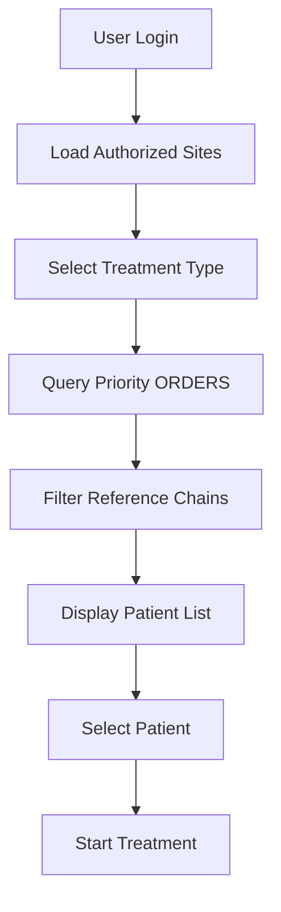
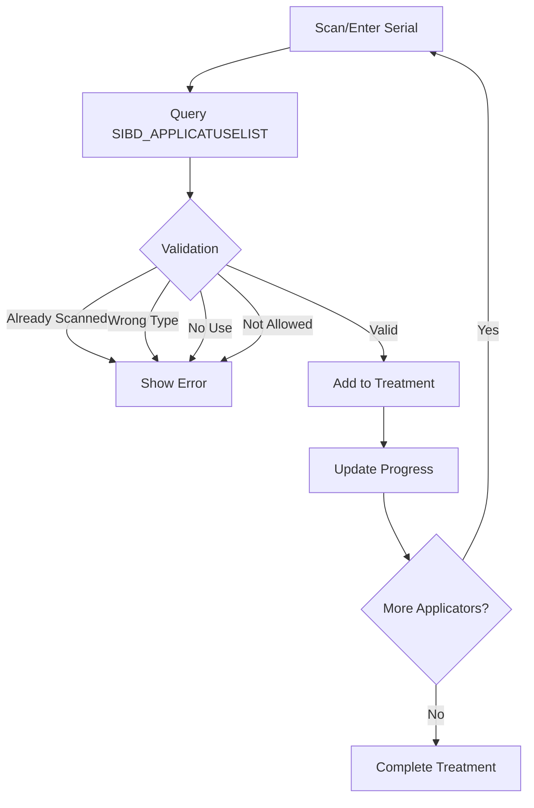
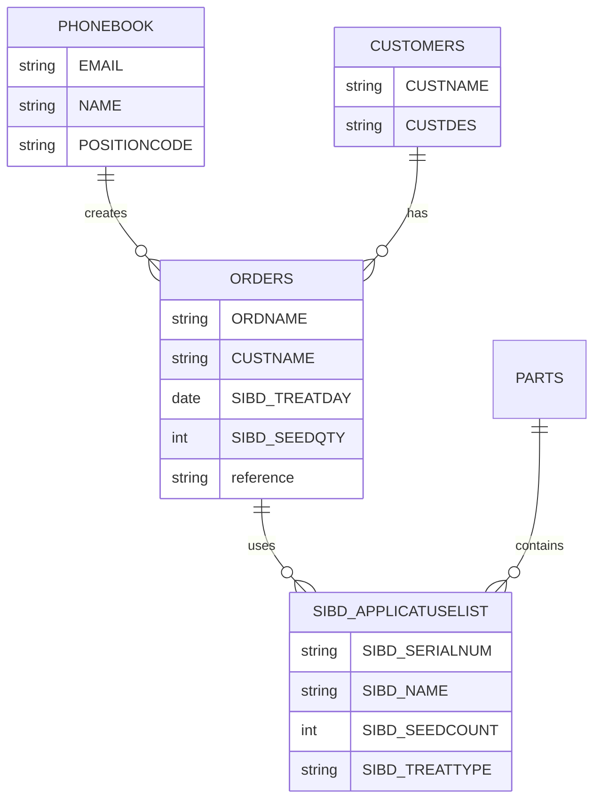

# Priority ERP Integration Guide

## Overview

This application integrates with Priority ERP system for real-time patient data, applicator validation, and treatment tracking. Priority serves as the authoritative source for all medical and inventory data.

## Priority API Endpoints

### Base Configuration
```javascript
{
  baseURL: process.env.PRIORITY_API_URL,
  headers: {
    'Authorization': `Bearer ${token}`,
    'Content-Type': 'application/json',
    'Accept': 'application/json'
  }
}
```

### Main Endpoints Used

| Endpoint | Purpose | Table |
|----------|---------|-------|
| `/PHONEBOOK` | User authentication and authorization | Employee directory |
| `/ORDERS` | Patient treatment orders | Medical orders |
| `/CUSTOMERS` | Site/facility information | Customer sites |
| `/SIBD_APPLICATUSELIST` | Applicator inventory and validation | Custom applicator table |
| `/PARTS` | Product/seed information | Inventory items |

## Authentication Flow

### 1. User Login via PHONEBOOK
```javascript
// Query PHONEBOOK for user validation
GET /PHONEBOOK?$filter=EMAIL eq 'user@example.com'
```

**Response Fields:**
- `EMAIL` - User email
- `NAME` - Full name
- `POSITIONCODE` - Authorization level (99 = full admin)
- `SITES` - Authorized treatment sites

### 2. Position Code Authorization

| Code | Access Level | Description |
|------|--------------|-------------|
| `99` | Full Admin | Access to all 100+ sites |
| Other | Site-Restricted | Access only to assigned sites |

## Data Retrieval Rules

### 1. Reference Chain Validation

**Critical**: Orders can reference other orders, creating chains. Only display root orders.

```javascript
// Validation logic
function isRootOrder(order) {
  return !order.reference || order.seedQty > 0;
}

// Filter chain references
orders.filter(order => {
  if (order.seedQty === 0 && order.reference) {
    return false; // Skip referenced orders
  }
  return true; // Show root orders
});
```

**Chain Detection:**
1. Check for `reference` field
2. If `seedQty = 0` and has reference, it's a child order
3. Follow chain to find root order
4. Detect circular references to prevent infinite loops

### 2. Query Optimization

#### Date Filtering (MANDATORY)
```javascript
// CORRECT - Filter at API level
const filter = `SIBD_TREATDAY ge datetime'2025-09-30T00:00:00'`;
GET /ORDERS?$filter=${filter}

// WRONG - Don't filter in memory
const orders = await getAllOrders();
return orders.filter(o => o.date >= today); // Bad practice
```

#### OData Query Format
```javascript
const query = {
  $filter: `SIBD_TREATDAY ge datetime'${date}'`,
  $select: 'ORDNAME,CUSTNAME,SIBD_TREATDAY,SIBD_SEEDQTY',
  $orderby: 'SIBD_TREATDAY desc',
  $top: 100
};
```

### 3. CUSTOMERS Endpoint (Sites)

#### Retrieve All Sites
```javascript
// For Position Code 99 users
GET /CUSTOMERS?$select=CUSTNAME,CUSTDES&$top=500&$orderby=CUSTNAME
```

**Important:**
- Use `$top: 500` to ensure all sites are retrieved
- AlphaTau has 100+ customer sites
- Only select required fields for performance

### 4. Data Source Management

#### Logging Indicators
```javascript
console.log('🧪 Using test data'); // Development mode
console.log('🎯 Priority API call successful'); // Production
console.log('❌ Priority API failed, using fallback'); // Error
```

#### Test Mode Rules
- Only use test data for `test@example.com`
- Never mix test and production data
- Apply same business logic to both data sources
- Clear logging of data source

## Applicator Validation

### SIBD_APPLICATUSELIST Table

#### Key Fields
| Field | Description | Usage |
|-------|-------------|-------|
| `SIBD_SERIALNUM` | Applicator serial number | Primary identifier |
| `SIBD_NAME` | Applicator name | Display name |
| `SIBD_SEEDCOUNT` | Seeds per applicator | Inventory tracking |
| `SIBD_NOUSE` | No use flag | Validation check |
| `SIBD_TREATTYPE` | Treatment type | Insertion/Removal |
| `SIBD_EXPIRY` | Expiry date | Validity check |
| `SIBD_SITE` | Allowed sites | Authorization |

### Validation Scenarios

#### 1. Already Scanned
```javascript
if (scannedApplicators.includes(serialNumber)) {
  return { valid: false, reason: 'already_scanned' };
}
```

#### 2. Wrong Treatment Type
```javascript
if (applicator.SIBD_TREATTYPE !== currentTreatment.type) {
  return { valid: false, reason: 'wrong_treatment' };
}
```

#### 3. Marked as No Use
```javascript
if (applicator.SIBD_NOUSE === 'Y') {
  return { valid: false, reason: 'no_use' };
}
```

#### 4. Not Allowed at Site
```javascript
if (!applicator.SIBD_SITE.includes(currentSite)) {
  return { valid: false, reason: 'not_allowed' };
}
```

#### 5. Valid
```javascript
return { valid: true, applicator: applicatorData };
```

### Advanced Validation Features

#### Day-Before/Day-After Import
```javascript
// Allow importing applicators from recent treatments
const yesterday = new Date(Date.now() - 24 * 60 * 60 * 1000);
const tomorrow = new Date(Date.now() + 24 * 60 * 60 * 1000);

GET /SIBD_APPLICATUSELIST?$filter=
  SIBD_LASTUSED ge datetime'${yesterday.toISOString()}' and
  SIBD_LASTUSED le datetime'${tomorrow.toISOString()}'
```

#### Fuzzy Matching
```javascript
// For manual entry with potential typos
function fuzzyMatch(input, applicatorName) {
  // Implement Levenshtein distance or similar
  return similarity > 0.8;
}
```

## Business Workflows

### Treatment Selection Flow


### Applicator Processing Flow


### Seed Tracking Types
1. **Full Use** - All seeds in applicator used
2. **Faulty** - Seeds were faulty/damaged
3. **No Use** - Applicator opened but not used

## Error Handling

### Priority API Failures
```javascript
try {
  const response = await priorityAPI.get('/ORDERS');
  console.log('🎯 Priority API successful');
  return response.data;
} catch (error) {
  console.log('❌ Priority API failed:', error.message);

  // Fallback strategy
  if (isDevelopment && user === 'test@example.com') {
    console.log('🧪 Using test data fallback');
    return testData;
  }

  throw new Error('Priority system unavailable');
}
```

### Graceful Degradation
1. Cache recent successful responses
2. Use test data in development
3. Show user-friendly error messages
4. Log detailed errors for debugging

## Performance Optimization

### Query Efficiency
```javascript
// GOOD - Specific field selection
$select=ORDNAME,CUSTNAME,SIBD_TREATDAY

// BAD - Selecting all fields
$select=*
```

### Pagination
```javascript
// Use $top and $skip for large datasets
$top=50&$skip=100
```

### Caching Strategy
```javascript
// Cache site list (changes rarely)
const siteCache = new Map();
const CACHE_TTL = 60 * 60 * 1000; // 1 hour

async function getSites() {
  if (siteCache.has('sites')) {
    const cached = siteCache.get('sites');
    if (Date.now() - cached.timestamp < CACHE_TTL) {
      return cached.data;
    }
  }

  const sites = await priorityAPI.get('/CUSTOMERS');
  siteCache.set('sites', {
    data: sites,
    timestamp: Date.now()
  });
  return sites;
}
```

## Common Pitfalls and Solutions

### Pitfall 1: Missing Date Filters
**Problem:** Retrieving all historical orders
**Solution:** Always include date filtering in queries

### Pitfall 2: Duplicate Orders
**Problem:** Same ORDNAME appearing multiple times
**Solution:** Check for duplicates and use most recent

### Pitfall 3: Reference Chain Loops
**Problem:** Circular references causing infinite loops
**Solution:** Track visited orders during chain traversal

### Pitfall 4: Mixed Data Sources
**Problem:** Test and production data mixed
**Solution:** Clear separation and logging of data sources

### Pitfall 5: Subform Entities Have Different Fields Than Direct Tables
**Problem:** Using fields from the direct table (e.g., `SIBD_APPUSELISTTEXT`) in a subform query (e.g., `ORDERS('...')/SIBD_APPUSELISTTEXT_SUBFORM`) causes HTTP 400 when axios URL-encodes `$select` as `%24select`
**Solution:** Only use fields that exist on the subform entity. Test with curl using `%24select` to verify. When you already have the parent context (e.g., order name from the URL path), don't request redundant fields like `ORD`.

### Pitfall 6: Axios URL-Encodes OData System Query Options
**Problem:** Axios encodes `$` in parameter keys to `%24` (e.g., `$select` becomes `%24select`), which changes how Priority OData validates the query — strict validation kicks in and rejects invalid fields
**Solution:** Be aware that curl with `$select` (unencoded) behaves differently from the application. Always test Priority queries with `%24select` to match what axios sends.

## Debugging Priority Integration

### Enable Detailed Logging
```javascript
// In priorityService.ts
const DEBUG = process.env.PRIORITY_DEBUG === 'true';

function logQuery(endpoint, params) {
  if (DEBUG) {
    console.log('Priority Query:', {
      endpoint,
      params,
      timestamp: new Date().toISOString()
    });
  }
}
```

### Common Debug Checks
1. Verify authentication token is valid
2. Check OData query syntax
3. Validate date format in filters
4. Inspect response data structure
5. Monitor API rate limits

### Test Queries
```bash
# Test authentication
curl -H "Authorization: Bearer TOKEN" \
  "https://priority-api/PHONEBOOK?$filter=EMAIL eq 'test@example.com'"

# Test orders query
curl -H "Authorization: Bearer TOKEN" \
  "https://priority-api/ORDERS?$filter=SIBD_TREATDAY ge datetime'2025-09-30T00:00:00'"

# Test applicator validation
curl -H "Authorization: Bearer TOKEN" \
  "https://priority-api/SIBD_APPLICATUSELIST?$filter=SIBD_SERIALNUM eq 'APP123'"
```

## Priority Table Relationships



## Security Considerations

1. **Token Management**
   - Store tokens securely
   - Implement token refresh
   - Clear tokens on logout

2. **Data Validation**
   - Validate all Priority responses
   - Sanitize data before display
   - Check data types and ranges

3. **Audit Logging**
   - Log all Priority API calls
   - Track data modifications
   - Monitor failed validations

4. **Access Control**
   - Respect Position Code permissions
   - Validate site access
   - Implement row-level security

## Support and Troubleshooting

For Priority API issues:
1. Check integration logs with emoji indicators
2. Verify OData query syntax
3. Validate authentication and permissions
4. Review this documentation
5. Contact Priority support if needed